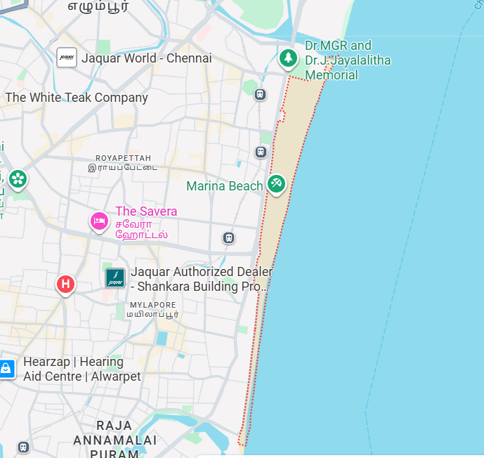

# Ex04 Places Around Me
## Date: 04/10/2025
## AIM
To develop a website to display details about the places around my house.

## DESIGN STEPS

### STEP 1
Create a Django admin interface.

### STEP 2
Download your city map from Google.

### STEP 3
Using ```<map>``` tag name the map.

### STEP 4
Create clickable regions in the image using ```<area>``` tag.

### STEP 5
Write HTML programs for all the regions identified.

### STEP 6
Execute the programs and publish them.

## CODE

```
map.html

<html> 
<head> 
<title>My City</title> 
</head> 
<body> 
<h1 align="center">
<font color="red"><b>Marina Beach </b></font>
</h1>
<h3 align="center"> 
<font color="blue"><b>SADHANA R (25017643)</b></font> 
</h3> 
<center>

<map name="MyCity">
<area shape="rect" coords="100,100,900,900" href="home.html" title="Marina Beach">
<area title="Savera Hotel" href="savera.html" coords="109,529,23,466" shape="rect">
<area title="The Jaguar World " href="jaguar.html" coords="301,39,70,132" shape="rect">
</map>
</center>
</body>
</html>

home.html

<!DOCTYPE html>
<html lang="en">
<head>
    <meta charset="UTF-8">
    <title>Marina Beach</title>
</head>
<body>
    <h1>Marina Beach</h1>
    <p>
        Marina Beach is special because it is the longest urban beach in India and the second-longest in the world, 
        stretching along the Bay of Bengal in Chennai. It is a vibrant landmark featuring historical statues, 
        the iconic Marina Lighthouse, an aquarium, and numerous food stalls offering local snacks. 
        While it's a popular spot for strolling, jogging, and people-watching, 
        swimming is prohibited due to strong, dangerous undercurrents.
    </p>
</body>
</html>


savera.html

<!DOCTYPE html>
<html lang="en">
<head>
    <meta charset="UTF-8">
    <title>Hotel Savera</title>
</head>
<body>
    <h1>Hotel Savera</h1>
    <p>
        Hotel Savera is a popular choice for many travelers thanks to its central location near the beach, markets, and attractions.
        Guests have called out its clean, comfortable, and spacious rooms, with housekeeping frequently highlighted.
    </p>
</body>
</html>


jaguar.html

<!DOCTYPE html>
<html lang="en">
<head>
    <meta charset="UTF-8">
    <title>Jaquar World - Chennai</title>
</head>
<body>
    <h1>Jaquar World, Chennai</h1>
    <p>
        Jaquar World in Chennai is an experience center offering a first-hand look at complete bathroom and lighting 
        solutions from the Jaquar Group. Visitors can see, touch, and interact with specialists to experience products 
        like faucets, showers, sanitaryware, and lighting, and get expert design advice to help them visualize and 
        realize their bath and light concepts. The center showcases the luxury, premium, and value brands of Jaquar—
        Artize, Jaquar, and Essco—and functions as a showroom rather than a point of sale.
    </p>
</body>
</html>


```
## OUTPUT

.png>)
.png>)
.png>)


## RESULT
The program for implementing image maps using HTML is executed successfully.
